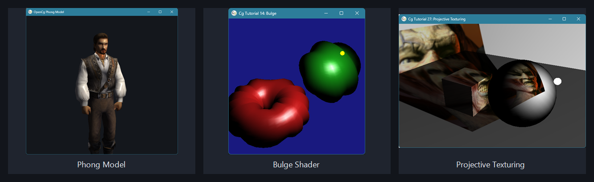

# OpenCg



OpenCg is a managed .NET wrapper around NVIDIA's legacy Cg runtime, plus OpenTK-based examples that port and preserve the original Cg/OpenGL sample set on modern .NET.

The current codebase contains the low-level native binding layer, a higher-level object model started from the cGNET work, and a Windows examples launcher with shader, texture, lighting, bump mapping, cubemap, fog, toon, projective texturing, and Phong model samples.

## Status

Cg is a discontinued NVIDIA technology. Cg 3.1 is the final release and is no longer under active development or support.

- Toolkit overview: https://developer.nvidia.com/cg-toolkit
- Toolkit download: https://developer.nvidia.com/cg-toolkit-download
- Documentation archive: http://developer.download.nvidia.com/cg/

This repository keeps the wrapper usable on modern .NET and includes fixes for interop, marshalling, callback lifetime, and native pointer handling issues in the original binding layer.

## Recent development

- Ported missing cGNET-style wrapper elements into `OpenCg.Graphics.ObjectModel`.
- Added managed wrappers for contexts, programs, parameters, effects, techniques, passes, states, annotations, buffers, and generic Cg objects.
- Added compiler include and error callback support with managed event argument types.
- Hardened native callback roots so delegates are not collected while the Cg runtime can still call them.
- Kept the Direct3D 9 branch out of the port intentionally.
- Added `OpenCg.ObjectModel.Examples` as a home for object-model focused examples.
- Expanded `OpenCg.Examples` with the full OpenTK sample launcher list through `[26] Phong Model`.
- Added a textured rotating OBJ model with fragment-level Phong lighting.
- Added PNG and OBJ asset copy rules for the examples project.

## Repository layout

- `Primusz.OpenCg/OpenCg`
  The managed wrapper library, including native P/Invoke bindings and the object model layer.
- `Primusz.OpenCg/OpenCg.Examples`
  A Windows Forms launcher with OpenTK examples, Cg shaders, textures, and model assets.
- `Primusz.OpenCg/OpenCg.ObjectModel.Examples`
  Examples that exercise the higher-level object model API.
- `Primusz.OpenCg/Primusz.OpenCg.sln`
  The main solution file.
- `Assets`
  README images and sample screenshots.

## Requirements

- Windows
- .NET 6 SDK
- NVIDIA Cg 3.1 runtime installed and available to the example application
- OpenGL-capable GPU/driver with compatibility-profile support

Notes:

- `OpenCg.Examples` targets `net6.0-windows` and is built as `x86`.
- The examples expect the `.cg` shader files and selected data assets to be copied next to the executable during build.
- Cg is a 32-bit-era runtime in this project setup, so make sure the native `cg.dll` and `cgGL.dll` versions match the process architecture.

## Build

From the repository root:

```powershell
dotnet build Primusz.OpenCg\Primusz.OpenCg.sln
```

The project currently builds with warnings from legacy APIs and platform-specific Windows drawing code. These are expected while the wrapper remains compatible with the original Cg/OpenGL sample style.

## Run the examples

Start the examples project from Visual Studio, or run the built executable from:

```text
Primusz.OpenCg\OpenCg.Examples\bin\Debug\net6.0-windows\
```

The example launcher currently includes these samples:

- `[01] Vertex Program`
- `[02] Fragment Program`
- `[03] Uniform Parameter`
- `[04] Varying Parameter`
- `[05] Texture Sampling`
- `[06] Vertex Twisting`
- `[07] Two Texture Accesses`
- `[08] Vertex Transform`
- `[09] Vertex Lighting`
- `[10] Fragment Lighting`
- `[11] Two Lights with Structs`
- `[12] Light Attenuation`
- `[13] Spotlight`
- `[14] Bulge`
- `[15] Particle System`
- `[16] Bump Mapping`
- `[17] Projective Texturing`
- `[18] Cube Map Reflection`
- `[19] Cube Map Refraction`
- `[20] Chromatic Dispersion`
- `[21] Specular Bump Map`
- `[22] Bump Map Floor`
- `[23] Bump Map Torus`
- `[24] Uniform Fog`
- `[25] Toon Shading`
- `[26] Phong Model`

## Highlighted samples

- **Phong Model**: loads `blaze.obj` and `blaze.png`, rotates the model continuously, and applies ambient, diffuse, and specular Phong lighting in Cg.
- **Bulge**: demonstrates vertex deformation with lighting.
- **Projective Texturing**: projects a texture across multiple primitives using Cg vertex and fragment programs.
- **Bump and specular bump mapping**: keeps the original tutorial-style normal mapping examples available in the OpenTK launcher.
- **Cubemap reflection/refraction and chromatic dispersion**: demonstrates environment sampling effects through the Cg runtime.

## Asset naming

The README images in `Assets` use stable, descriptive names:

- `opencg-sample-gallery.png`
- `opencg-phong-model.png`
- `opencg-bulge-shader.png`
- `opencg-projective-texturing.png`

## Development notes

- The wrapper contains unsafe/native interop code, so marshalling correctness matters.
- Several APIs in the wrapper return pointers owned by the Cg runtime; these should be copied into managed data structures instead of being exposed directly as managed arrays.
- Keep managed delegates rooted whenever they are registered with the native runtime as callbacks.
- Avoid exposing unsupported Cg query paths if they can dereference invalid native handles.
- If you extend the examples, prefer time-based animation over frame-based animation so behavior stays stable across different frame rates.
- Preserve the original tutorial behavior where possible, but prefer modern .NET project structure and explicit asset copy rules.
